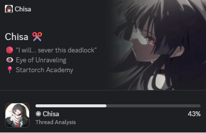

# Discord Day Progress



O **Discord Day Progress** é um aplicativo de bandeja do sistema (System Tray) desenvolvido em Python que atualiza dinamicamente o status do seu perfil do Discord com a porcentagem de progresso do dia atual (por exemplo, exibindo `0.4567` para representar `45.67%` do dia decorrido).

O app funciona em segundo plano e se integra ao recurso de perfis dinâmicos de aplicativos do Discord.

---

## 🚀 Funcionalidades

- **Atualização Automática**: Atualiza o progresso do dia periodicamente (por padrão, a cada 10 minutos).
- **Execução em Segundo Plano**: Roda silenciosamente na bandeja do sistema (System Tray).
- **Menu Interativo**:
  - **Atualizar agora**: Força a atualização do progresso imediatamente.
  - **Abrir com o Windows**: Ativa ou desativa a inicialização automática do app junto com o sistema operacional (via registro do Windows).
  - **Sair**: Encerra o aplicativo de forma limpa.
- **Ícone Customizável**: Carrega automaticamente um ícone customizado a partir de `assets/icon.png` ou gera um ícone padrão caso não exista.
- **Facilidade de Build**: Acompanha um script PowerShell (`build.ps1`) para automação de tarefas de desenvolvimento, execução e compilação do executável `.exe`.

---

## 🛠️ Pré-requisitos

Para executar ou compilar o projeto, você precisará de:

1. **Python 3.14+** instalado.
2. Gerenciador de dependências [**uv**](https://astral.sh/uv/) instalado em sua máquina.
   - *Caso não tenha o `uv` instalado, você pode instalá-lo no Windows executando o comando:*
     ```powershell
     powershell -c "irm https://astral.sh/uv/install.ps1 | iex"
     ```
3. Uma conta no Discord e um bot criado no [Discord Developer Portal](https://discord.com/developers/applications).

---

## ⚙️ Configuração do Discord

Para que o aplicativo atualize seu perfil, você precisa de um Aplicativo/Bot do Discord e de um token de autenticação:

1. Acesse o **[Discord Developer Portal](https://discord.com/developers/applications)**.
2. Crie uma nova aplicação (por exemplo, "Day Progress"). Copie o **Application ID** (`DISCORD_APP_ID`).
3. Vá para a aba **Bot**, crie um Bot para essa aplicação e copie o token dele (`DISCORD_BOT_TOKEN`).
4. Certifique-se de que o bot está no mesmo servidor ou que você tem as permissões necessárias para atualizar identidades/perfis.
5. Obtenha o seu ID de Usuário do Discord (`DISCORD_USER_ID`) ativando o Modo Desenvolvedor nas configurações do seu Discord, clicando com o botão direito sobre o seu perfil e selecionando "Copiar ID".

---

## 🎨 Como Criar e Equipar o Widget no Discord

Para que a barra de progresso do dia apareça e funcione corretamente no seu perfil do Discord, você precisará criar e equipar um widget customizado na sua aplicação do Discord.

Este processo baseia-se nos seguintes tutoriais de referência:
- 📖 [Tutorial Escrito (TroubleChute Hub)](https://hub.tcno.co/discord/widgets/)
- 🎥 [Tutorial em Vídeo (TroubleChute - YouTube)](https://youtu.be/CzOAaizTn_w?si=WilLGEwQnK-MQqLD)

Abaixo está um passo a passo consolidado do que deve ser feito:

### 1. Habilitar a aba de Widgets no Discord Developer Portal
Por padrão, a seção de customização de widgets de jogos está oculta no painel de desenvolvedores. Para ativá-la:
1. No painel da sua aplicação, vá para a aba **Social SDK** (sob a seção **Games** no menu lateral esquerdo).
2. Preencha o formulário de consentimento com dados fictícios (Company Name, Full Name, Work Email, Role, etc.) e clique em **Submit**.
3. Abra o console do desenvolvedor do seu navegador (`F12` ou `Ctrl+Shift+I`) na aba **Console**.
4. Cole o seguinte código Javascript e pressione `Enter`:
   ```javascript
   let _mods = webpackChunkdiscord_developers.push([[Symbol()],{},r=>r.c]);
   webpackChunkdiscord_developers.pop();

   let findByProps = (...props) => {
       for (let m of Object.values(_mods)) {
           try {
               if (!m.exports || m.exports === window) continue;
               if (props.every((x) => m.exports?.[x])) return m.exports;

               for (let ex in m.exports) {
                   if (props.every((x) => m.exports?.[ex]?.[x]) && m.exports[ex][Symbol.toStringTag] !== 'IntlMessagesProxy') return m.exports[ex];
               }
           } catch {}
       }
   }

   findByProps("getAll").getAll().find(e=>e.getName() === "ApexExperimentStore").createOverride("2026-03-widget-config-editor", 1)
   ```
5. Atualize a página do painel. Uma nova aba chamada **Widget** aparecerá sob a seção **Games** no menu lateral.

### 2. Criar e Configurar o Widget de Progresso
1. Vá até a nova aba **Widget** e clique em `+ Create Widget`.
2. No menu suspenso superior esquerdo do construtor de widgets, selecione a área **Widget Bottom**.
3. Escolha o design do tipo **Progress** (Barra de Progresso).
4. Defina as variáveis do widget associando-as a valores dinâmicos (`User Data`):
   - Configure o valor atual (`Value`) para utilizar o tipo `User Data` e insira a chave da variável de número como `progress` (o mesmo nome enviado pelo script `main.py`).
   - Configure o valor máximo (`Max Value`) para ser um valor fixo de `1.0` (ou crie outra variável estática com esse valor no Sample Data), já que o script calcula o progresso diário como um valor decimal fracionário entre `0.0` e `1.0`.
5. No painel inferior de **Validation**, certifique-se de que diz `No validation errors` (você precisará preencher um preview e mini profile primeiro com imagens públicas), salve as alterações no botão no topo direito e clique em **Publish**.

### 3. Equipar o Widget no seu Perfil do Discord
Você precisa forçar a exibição do widget criado no seu perfil para poder selecioná-lo:
1. No seu aplicativo de desktop do Discord (ou no Discord web logado), abra as ferramentas de desenvolvedor (`Ctrl+Shift+I` ou `F12`) na aba **Console**.
2. Cole o código a seguir, substituindo `"SEU_APPLICATION_ID"` pelo ID real do seu aplicativo criado no Developer Portal:
   ```javascript
   let _mods=webpackChunkdiscord_app.push([[Symbol()],{},e=>e.c]);webpackChunkdiscord_app.pop();
   let findByProps=(...e)=>{for(let t of Object.values(_mods))try{if(!t.exports||t.exports===window)continue;if(e.every(e=>t.exports?.[e]))return t.exports;for(let r in t.exports)if(e.every(e=>t.exports?.[r]?.[e])&&"IntlMessagesProxy"!==t.exports[r][Symbol.toStringTag])return t.exports[r]}catch{}};

   findByProps("getFeaturedApplicationIds").getFeaturedApplicationIds().push("SEU_APPLICATION_ID");
   ```
3. Pressione `Enter`.
4. Vá em **Configurações do Usuário** no Discord -> **Perfis** -> aba **Widget de Perfil** (ou nos cards sugeridos no seu perfil principal).
5. Selecione o Widget do seu aplicativo e salve as alterações para que ele passe a ser exibido publicamente no seu card do Discord.

---

## 💻 Instalação e Execução

### 1. Inicializar o ambiente e dependências
Execute o comando de configuração automatizado para criar o arquivo de configuração `.env` e instalar as dependências do Python dentro de um ambiente virtual:

```powershell
.\build.ps1 setup
```

### 2. Configurar as variáveis de ambiente
Abra o arquivo `.env` recém-criado na raiz do projeto e preencha as variáveis correspondentes:

```env
DISCORD_APP_ID=seu_application_id_aqui
DISCORD_USER_ID=seu_user_id_aqui
DISCORD_BOT_TOKEN=seu_bot_token_aqui
UPDATE_INTERVAL_MINUTES=10
```

### 3. Executar o Aplicativo
Você pode executar o aplicativo de duas maneiras:

*   **Modo de depuração (com janela de terminal para ver logs):**
    ```powershell
    .\build.ps1 run
    ```
*   **Modo silencioso (roda direto em background sem terminal):**
    ```powershell
    .\build.ps1 run-silent
    ```

---

## 📦 Compilando para Executável (.exe)

Se você preferir rodar o aplicativo como um executável independente do Windows sem precisar ter o Python instalado ou iniciar o script manualmente via terminal:

1. Gere o executável executando:
   ```powershell
   .\build.ps1 build
   ```
2. O PyInstaller compilará o script e criará uma pasta chamada `dist`.
3. O executável estará disponível em `dist/DiscordDayProgress.exe`.
4. O arquivo `.env` será copiado automaticamente para a pasta `dist` (garanta que ele esteja configurado antes de rodar o `.exe`).

---

## 🎨 Personalização do Ícone

Você pode definir o ícone que aparecerá na bandeja do sistema e no executável compilado:
1. Substitua o arquivo na pasta `assets/icon.png` por uma imagem PNG quadrada de sua escolha.
2. Ao rodar o script `build.ps1 build`, o assistente executará o script `make_icon.py` para gerar uma versão `.ico` compatível e embutir no executável final.

---

## 📋 Comandos Disponíveis do Script `build.ps1`

| Comando | Descrição |
| :--- | :--- |
| `setup` | Instala dependências do projeto via `uv sync` e gera o arquivo `.env` inicial. |
| `env` | Verifica ou cria o arquivo `.env` baseado em `.env.example`. |
| `run` | Executa o aplicativo exibindo a janela de console (útil para ver erros e logs). |
| `run-silent` | Executa o aplicativo oculto em background. |
| `build` | Compila o aplicativo para um executável `.exe` único dentro da pasta `dist/`. |
| `clean` | Remove os diretórios temporários `build/`, `dist/`, arquivos `.spec` e `__pycache__`. |
| `all` | Executa a configuração completa e em seguida a compilação do executável (`setup` + `build`). |
| `help` | Exibe o menu de ajuda com a lista de comandos e exemplos. |

---

## 📄 Licença

Este projeto está sob a licença MIT. Sinta-se livre para usar, modificar e distribuir.
